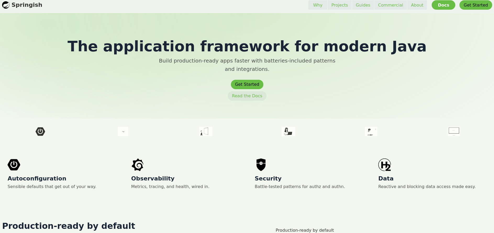

# FullApp - Vaadin Spring Boot Demo

This project is a **Vaadin 24 + Spring Boot 3** web application demonstrating a custom theme (`springish`) inspired by Spring.io.

---

## Features

- Custom Lumo-based theme (`springish`) with greenish colors.
- Responsive layout using `AppLayout`.
- Proper separation of **AppShell** and UI components.
- Support for theme images and CSS overrides.
- Example home view.